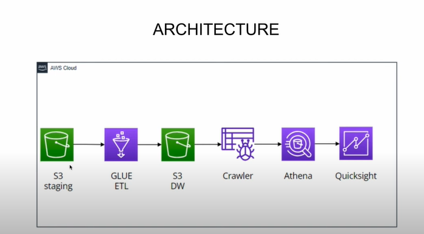

# AWS Pipeline Using Spotify Data

### Overview

This project demonstrates a basic data transformation pipeline using AWS Glue and Amazon Athena to process Spotify data stored in CSV format. The pipeline involves loading data from three CSV files (artists.csv, tracks.csv, albums.csv), performing basic transformations such as joins and column filtering using AWS Glue, and then storing the refined data in an Amazon S3 directory named datawarehouse. Finally, users can query the refined data directly from Amazon S3 using Amazon Athena.

## Architecture Diagram

## Architecture Diagram

## Instructions

1. **CSV Files**: Ensure that the three CSV files (`artists.csv`, `tracks.csv`, `albums.csv`) containing Spotify data are uploaded to the S3 staging bucket.

2. **AWS Glue Job**: Create an AWS Glue job to perform transformations. The job should:
   - Load the data from the S3 staging bucket.
   - Apply necessary transformations such as joins and dropping redundant columns.
   - Write the refined data to the `datawarehouse` directory in Amazon S3.

3. **Amazon Athena**: After the Glue job execution is complete, navigate to Amazon Athena and run SQL queries directly on the refined data stored in the `datawarehouse` directory.

## Additional Notes
- Ensure proper IAM roles and permissions are set up for AWS Glue and Amazon Athena to access S3 buckets.
- Monitor Glue job execution for any errors or issues during data transformation.
- Consider scheduling Glue jobs to run at specific intervals for automated data processing.

